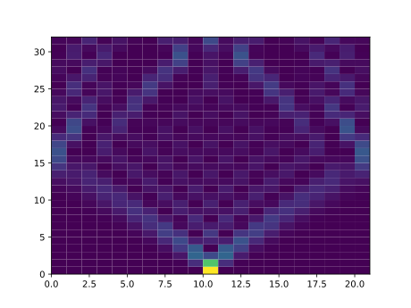

2024/10/24

- QiboTensornetwork を使いたい
    * 失敗
- Hello QiboTensornetwork
- スピン鎖の励起状態伝搬
    * Quimbによる実行 (失敗)
    * numpy バックエンドによる実行
- リンク

# QiboTensornetwork を使いたい

GitHubから最新版をクローンしてドキュメントの指示の通りにインストールします。`qibo 0.0.2`がインストールされました。
```
$ git clone https://github.com/qiboteam/qibotn.git qibotn
$ cd qibotn
$ pip install .
```

```
In [1]: import qibotn
In [2]: qibotn.__version__
Out[2]: '0.0.2'
```

個人ではNVIDIAのハードウェアを持っている訳ではないため、[Quimb](https://quimb.readthedocs.io/en/latest/index.html) (quantum information many-body) を使うことにします。
```
$ pipenv install quimb
```

## 失敗

pipenv からインストールする場合にはPython 3.11以上では使えないライブラリを用いているため、3.10.5の環境を作り直す必要があります。下の方法でインストールすると `qibo v0.0.1`がインストールされてしまいました。このバージョンは古く、`qibo` から `qibotn` バックエンドの読み込みのところでエラーを生じてしまいました。
```
$ pipenv install qubotn
```


# Hello QiboTensornetwork

QiboTensornetwork のサンプルを見ながら使ってみます。バックエンドは Quimb を使って計算をしてみます。テンソルネットワークは簡単に計算ができるはずなので、25量子ビットのGHZ状態を作ってみます。

```
import qibo
import os

os.environ["QUIMB_NUM_PROCS"] = str( os.cpu_count() // 2 )

computation_settings = {                # computation_settings = {
    'MPI_enabled' : False,              #     'MPI_enabled' : False,
    'MPS_enabled' : False,              #     'MPS_enabled' : False, 
    'NCCL_enabled': False,              #     'NCCL_enabled': False,
    'expectation_enabled': False,       #     'expectation_enabled': { 'pauli_string_pattern': 'IXZ' }
}                                       # }
                                        # computation_settings = { 'MPS_enabled'  : { 'method': 'svd', 'cutoff': 1e-6, 'cutoff_mode': 'abs' }}

qibo.set_backend(backend = 'qibotn', platform = 'qutensornet', runcard = computation_settings )

number_of_qubits = 25

c = qibo.Circuit( number_of_qubits )
c.add( qibo.gates.H( 0 ))
for i in range( 0, number_of_qubits - 1 ):
    c.add( qibo.gates.CNOT( i, i + 1 ))

result = c.execute()

print( c.diagram() )
print( result.state() )
```

50量子ビットにすると `RuntimeError: State does not fit in /CPU:0 memory.Please switch the execution device to a different one using qibo.set_device.` というエラーが出てしまいました。少し期待外れですが25量子ビットでは動いています。

`computation_settings` はバックエンドの動作を指定します。`qibotn.backends.quimb` のソースコードを読めば分かるのですが、Quimb では MPI並列、[NCCL](https://developer.nvidia.com/nccl) (NVIDIA Collective Communications Library)、期待値計算は使うことができず、numpyベースのQuimbのみを使うことができます。その場合にはテンソルの縮約をとった最後は `2^num_of_qubits x 16 byte` の状態ベクトルが必要になります。20ビットで16 MByte、30ビットで16 GByteですので、50量子ビットは無理そうですね。密ベクトル表現さえしなければGHZ状態の表現は大したことないのですが、ここが足かせになっているようです。

```
q0 : ─H─o───────────────────────────────────────────────
q1 : ───X─o─────────────────────────────────────────────
q2 : ─────X─o───────────────────────────────────────────
q3 : ───────X─o─────────────────────────────────────────
q4 : ─────────X─o───────────────────────────────────────
q5 : ───────────X─o─────────────────────────────────────
q6 : ─────────────X─o───────────────────────────────────
q7 : ───────────────X─o─────────────────────────────────
q8 : ─────────────────X─o───────────────────────────────
q9 : ───────────────────X─o─────────────────────────────
q10: ─────────────────────X─o───────────────────────────
q11: ───────────────────────X─o─────────────────────────
q12: ─────────────────────────X─o───────────────────────
q13: ───────────────────────────X─o─────────────────────
q14: ─────────────────────────────X─o───────────────────
q15: ───────────────────────────────X─o─────────────────
q16: ─────────────────────────────────X─o───────────────
q17: ───────────────────────────────────X─o─────────────
q18: ─────────────────────────────────────X─o───────────
q19: ───────────────────────────────────────X─o─────────
q20: ─────────────────────────────────────────X─o───────
q21: ───────────────────────────────────────────X─o─────
q22: ─────────────────────────────────────────────X─o───
q23: ───────────────────────────────────────────────X─o─
q24: ─────────────────────────────────────────────────X─
[0.70710678+0.j 0.        +0.j 0.        +0.j ... 0.        +0.j
 0.        +0.j 0.70710678+0.j]
```

# スピン鎖の励起状態伝搬

特にやることもないので、量子ビットをスピンと見立てて励起を伝搬させてみます。相互作用を `H_int = Σ_<i,i+1> { X_i X_(i+1) + Y_i Y_(i+1) } / 2` として、1次元スピン鎖の中央を励起します。中央からの励起の伝搬の様子を見てみることにします。こういう相互作用は局所的でかつ結合次元を大きくすることがないので、いい例題となります。

```
import qibo
import numpy
import scipy.linalg
import matplotlib.pylab as pl

sp = numpy.array( [[ 0, 1 ], [ 0, 0 ]] )
sm = sp.T
sx = sp + sm; sz = sp @ sm - sm @ sp; sy = ( sz @ sx - sx @ sz ) / 2j

def spin_propagation( number_of_qubits : int, number_of_rounds : int, Upropagator : numpy.ndarray ) -> list:

    c = qibo.Circuit( number_of_qubits )
    c.add( qibo.gates.H( number_of_qubits // 2 ))
    for j in range( number_of_rounds ):
        for i in range( 1, number_of_qubits, 2 ):
            c.add( qibo.gates.Unitary( Upropagator, i - 1, i ))
        for i in range( 2, number_of_qubits, 2 ):
            c.add( qibo.gates.Unitary( Upropagator, i - 1, i ))
    print( c.diagram() )

    contr_axis          = [[ i for i in range( number_of_qubits ) if i != j ] for j in range( number_of_qubits )]
    excited_state_index = 1

    prob_tensor = c.execute().probabilities().reshape( (2,) * number_of_qubits )
    excitation = [ numpy.sum( prob_tensor, axis = tuple( ax ))[ excited_state_index ]  for ax in contr_axis ]

    return excitation

dt           = 1/128
Hinteraction = 0.5 * numpy.kron( sx, sx ) + 0.5 * numpy.kron( sy, sy )  # ( XX + YY ) / 2
     # equivalent to numpy.kron( sp, sm ) +       numpy.kron( sm, sp )
Upropagator  = scipy.linalg.expm( 1j * 2 * numpy.pi * Hinteraction * dt )

number_of_qubits = 21
number_of_rounds = 256

packets = []
for i in range( 0, number_of_rounds, 8 ):
  excitation = spin_propagation( number_of_qubits, i, Upropagator )
  packets.append( excitation )

pl.pcolor( numpy.array( packets ))
pl.savefig( 'qibotn-10.svg' )
```

2量子ビットのXX+YY相互作用を結合強度に対して1/128だけ時間発展させた `U_propagator` を作ります。量子ビットに互い違いになるように印加して、`H_int` が全スピンに対して同時に印加される感じを鈴木トロッター分解により実現します(下図を参照。UはXX+YYを1/128だけ時間発展する演算子)。

```
q0 :  ------U------------------------
q1 :  ------U----------------U-------
q2 :  ----------U------------U-------
q3 :  ----------U----------------U---
q4 :  ------U--------------------U---
q5 :  ------U----------------U-------
q6 :  ----------U------------U-------
q7 :  ----------U----------------U---
q8 :  ------U--------------------U---
q9 :  ------U----------------U-------
q10:  --H-------U------------U-------
q11:  ----------U----------------U---
q12:  ------U--------------------U---
q13:  ------U----------------U-------
q14:  ----------U------------U-------
q15:  ----------U----------------U---
q16:  ------U--------------------U---
q17:  ------U----------------U-------
q18:  ----------U------------U-------
q19:  ----------U----------------U---
q20:  ---------------------------U---
```

`c.execute()`により回路が実行され、`.probabilities()`により`2^number_of_qubits`次元の占有率のベクトルが得られます。量子ビットごとの占有率を得るために、このベクトルを `number_of_qubits` 階のテンソルに `reshape()` しておきます。`prob_tensor[i0, i1, ..., i_(number_of_qubits-1)]` のテンソルは、興味がない成分に対して和をとるとその周辺確率分布を得ます。トレースアウトすべきテンソルの足 `contr_axis` を使って、各量子ビットの占有率を得るプログラムとなっています。

回路を最初から作り直しながらスピン鎖の時間発展を追いかけるのではなく、縮約をとった密ベクトルを初期値にして `H_int` を時間発展させたほうが効率的だった反省しました。

## Quimbによる実行 (失敗)

このプログラムを実行しようとしたところ、`qibo.gates.Unitary` にエラーが出てしまいました。どうやら Quimb の実行は `quimb.tensor.circuit.Circuit.from_openqasm2_str()` に頼っているようで、QASMは`qibo.gates.Unitary` や `qibo.gates.fSim` などをサポートしていないと言われてしまいます。2量子ビットゲートの表現として、かなり貧弱ですね。ネイティブゲートのシミュレーションに使おうと思ったので、がっかりです。

```
[Qibo 0.2.12|INFO|2024-10-xx xx:16:45]: Using qibotn (QuimbBackend) backend on /CPU:0
[Qibo 0.2.12|ERROR|2024-10-xx xx:17:52]: Unitary is not supported by OpenQASM

NotImplementedError: Unitary is not supported by OpenQASM
```

## numpy バックエンドによる実行

妥協して numpy バックエンドにより実行してみます。
```
qibo.set_backend(backend = 'numpy')
```

```
[Qibo 0.2.12|INFO|2024-10-xx xx:18:40]: Using numpy backend on /CPU:0
```



横軸にスピン鎖の番号、縦軸に時間ステップ ÷ 8、色軸に占有率を表示しています。時間ステップは変化が緩やかなので1/8程度に間引いて表示しています。中央に励起されたスピンが時間発展により周囲に広がっていくのがよくわかります。

## Quimbによる実行


# リンク

- [Qibotn](https://github.com/qiboteam/qibotn)
- [Quimb](https://quimb.readthedocs.io/en/latest/index.html) (quantum information many-body)
- NVIDIA Collective Communications Library: [NCCL](https://developer.nvidia.com/nccl)
