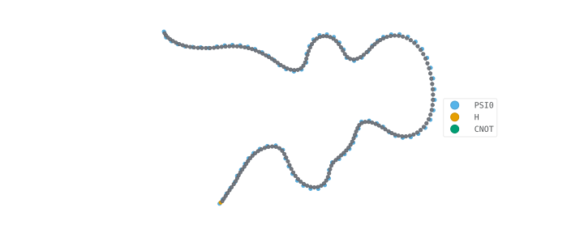

2024/10/27

- はじめての Quimb
    * インストール
    * 回路シミュレーターとして何ができるのか
        - SU4
- リンク

# はじめての Quimb

[Quimb](https://quimb.readthedocs.io/en/latest/index.html)は量子情報の多体系のテンソルネットワークライブラリのようです。

## インストール

```
$ pipenv install quimb
```

```
import quimb
```

## 回路シミュレーターとしてどんなゲートが実装できるのか

後にやりたいことができないことが判ると悲しいため、最初に使えるそうな2量子ビットゲートを調べておきます。
```
print(quimb.tensor.circuit.TWO_QUBIT_GATES)
```

なんでも出来そうな2量子ビットゲートとしては、`SU4`あたりですね。
```
{'CNOT', 'CRX', 'CRY', 'CRZ', 'CU1', 'CU2', 'CU3', 'CX', 'CY', 'CZ', 'FS', 'FSIM', 'FSIMG', 'GIVENS', 'IS', 'ISWAP', 'RXX', 'RYY', 'RZZ', 'SU4', 'SWAP'}
```

そういえば回路の途中での測定または射影演算子が見当たりません。毎回新しい量子ビットをくっつけて最後にまとめて測定するしかないのでしょう。

### SU4

```
 quimb.tensor.circuit.Circuit.su4(theta1, phi1, lamda1, theta2, phi2, lamda2, theta3, phi3, lamda3, theta4, phi4, lamda4, t1, t2, t3, i, j, gate_round=None, parametrize=False, **kwargs)

# ---- A1 ---o--- Rz(t1) ---+--------------o--- A3 ---
#            |              |              |
# ---- A2 ---+--- Ry(t2) ---o--- Ry(t3) ---+--- A4 ---

```


こちらの論文 [quant-ph/0308006](https://arxiv.org/abs/quant-ph/0308006) が引用されており、15個の1量子ビット回転と3つのCNOTから構成されるゲートとなっており、SU(4)のパラメータ表現(恐らく既約)となっています。各 `θ_i`、`φ_i`、`λ_i`は1量子ビットの回転量、`t_i` はCNOT中に挿入される回転ゲートの回転量となっています。自分で任意のSU2を印加したい場合にはこの形への変形を要する点が面倒です。`θ`、 `φ`、`λ` の表現はU3と同じであり、次のようになっています。ざっくりですが `θ` は緯度方向の回転量、`φ` が回転軸方向、`λ` は経度方向の回転量を決めるイメージです。
```
                           [             cos( theta / 2 )  -exp(j lambda)         sin( theta / 2 ) ]
 A (theta, phi, lambda) =  [                                                                       ]
                           [ exp (j phi) sin( theta / 2 )   exp(j (phi + lambda)) cos( theta / 2 ) ]
```
[前回](./qibotn-1.md)のようにネイティブゲートの1つのタイムステップを毎回この形に変形するのも面倒ですね。

# 量子回路の実装とグラフ表現

100量子ビットでGHZ状態を生成してみます。

```
%config InlineBackend.figure_formats = ['svg']

import random
import quimb
import quimb.tensor


num_qubits = 100
circuit = quimb.tensor.Circuit( num_qubits )

circuit.apply_gate( 'H', 0 )
for i in range( 1, num_qubits ):
    circuit.apply_gate( 'CNOT', i - 1, i )

fig = circuit.psi.draw( color = ['PSI0', 'H', 'CNOT'], figsize = ( 10, 4 ), return_fig = True )
fig.savefig( 'quimb-10.svg' )

```

長い鎖状のグラフが生成されました。元々状態は PSI0 で表示され、テンソルの足は `k<数字>`で表示されているようです。図では小さすぎて足が見えないようです。

## 計算と測定値

次のような計算ができるようです。

- 完全波動関数を示す密ベクトル
- 局所的な期待値または部分系の密度行列
- 周辺確率分布やシングルショットのビット列
- 状態の忠実度やユニタリ過程の忠実度

## 結果のサンプリング

結果を測定してみます。結果のビット値を頻度値でカウントすることができます。
```
import collections

number_of_samples = 128
collections.Counter( circuit.sample( number_of_samples ))
```

```
Counter({'000000000000000000000000000000000000000000000000000000000000000000000000000000000000000000': 67,
        '111111111111111111111111111111111111111111111111111111111111111111111111111111111111111111': 61})
```

またはビット列値を毎回生成することもできます。乱数のシード値を与えることもできるようです。
```
for _bitstring in circuit.sample( number_of_samples, seed = 42 ):                    # sample it a few times
    print( _bitstring )
```

## 局所的な期待値の測定

局所的な演算子をパウリ演算子を用いて定義します。`&`を使うとテンソル積が表現できるようです。どのビットに作用させたいのかは、`local_expectation()` の第2引数で指定します。

```
quimb.pauli('X') & quimb.pauli('X')
# [[0.+0.j 0.+0.j 0.+0.j 1.+0.j]
#  [0.+0.j 0.+0.j 1.+0.j 0.+0.j]
#  [0.+0.j 1.+0.j 0.+0.j 0.+0.j]
#  [1.+0.j 0.+0.j 0.+0.j 0.+0.j]]

circuit.local_expectation( quimb.pauli('X') & quimb.pauli('X'), ( 0, 1 ))
# 0j
```

本来であれば GHZ状態の XXX....X パリティを測定したいのですが、そもそもそんなパウリ行列すら作ることが難しいようです。100量子ビットから見ると16個のパウリXの直積は十分局所的だと思うのですが、メモリ不足だとエラーが生じてしまいました。
```
circuit.local_expectation( \
    quimb.pauli('X') & quimb.pauli('X') & quimb.pauli('X') & quimb.pauli('X') & \
    quimb.pauli('X') & quimb.pauli('X') & quimb.pauli('X') & quimb.pauli('X') & \
    quimb.pauli('X') & quimb.pauli('X') & quimb.pauli('X') & quimb.pauli('X') & \
    quimb.pauli('X') & quimb.pauli('X') & quimb.pauli('X') & quimb.pauli('X'),  \
    ( 0, 1, 2, 3, 4, 5, 6, 7, 8, 9, 10, 11, 12, 13, 14, 15 ))
# Unable to allocate 64.0 GiB for an array with shape (65536, 65536) and data type complex128
```

このような場合は、サンプリングの方が便利です。見たい方向に向けてから、ビット列の1の数を数えて2の剰余を計算します。
```
circuit = quimb.tensor.Circuit( num_qubits )
circuit.apply_gate( 'H', 0 )
for i in range( 1, num_qubits ):
    circuit.apply_gate( 'CNOT', i - 1, i )
for i in range( num_qubits ):
    circuit.apply_gate( 'H', i )

[_b.count('1') % 2 for _b in circuit.sample( 16 )]
# [0, 0, 0, 0, 0, 0, 0, 0, 0, 0, 0, 0, 0, 0, 0, 0]
```

## 密ベクトルを取得

```
circuit.to_dense()
```

# Steane 符号でも実装してみる

初期化の必要性にについては[StackExchange](https://quantumcomputing.stackexchange.com/questions/28807/how-to-implement-the-circuit-of-steane-code-for-quantum-error-correction)にコメントが書いてある。結局CSSである限り不要ということである。

> For a CSS code, initializing all physical qubits into |0> and then measuring the stabilizers of the code is an encoding circuit for logical |0>, and also for logical |1>, up to the Pauli frame. Correspondingly, to prepare logical |+> or |-> up to the Pauli frame, start by initializing the physical qubits into |+> instead of |0>.
> 
> In stabilizer codes, everything is much easier if you let the Pauli frame do what it wants instead of trying to control it. What this means in practice is that, instead of trying to prepare a complex stabilizer (or observable), you can instead choose to simply measure that stabilizer (or observable). When you later need to check that stabilizer, where you would normally check if it's in its +1 or -1 eigenstate, you instead compare it to the result of the initializing measurement.
> 
> When I was first getting into error correction, I tried to make all my stabilizers be +1. As I did more and more complex things, this got more and more onerous and tedious. I was running expensive Dijkstra searches and Gaussian eliminations, to enforce a property that doesn't even achieve anything useful. So... I stopped doing that. And everything got easier. Let the stabilizers fall where they may.


```
#
#      +--- 1 ---+
#      |    a    |
#  +---2--- 3 ---4---+
#  |   b    |   c    |
#  5--------6--------7

parityZ = [ ( 'D1', 'Za' ), ( 'D2', 'Zb' ), ( 'D3', 'Zc' ), 
            ( 'D4', 'Za' ), ( 'D3', 'Zb' ), ( 'D6', 'Zc' ),
            ( 'D2', 'Za' ), ( 'D5', 'Zb' ), ( 'D4', 'Zc' ),
            ( 'D3', 'Za' ), ( 'D6', 'Zb' ), ( 'D7', 'Zc' ) ]
parityX = [ ( 'Xa', 'D1' ), ( 'Xb', 'D2' ), ( 'Xc', 'D3' ),
            ( 'Xa', 'D4' ), ( 'Xb', 'D3' ), ( 'Xc', 'D6' ),
            ( 'Xa', 'D2' ), ( 'Xb', 'D5' ), ( 'Xc', 'D4' ),
            ( 'Xa', 'D3' ), ( 'Xb', 'D6' ), ( 'Xc', 'D7' )  ]
qmap = { 'D1' : 0,  'D2' : 1, 'D3' : 2, 'D4' : 3, 'D5' : 4, 'D6' : 5, 'D7' : 6, \
         'Za' : 7, 'Zb' : 8, 'Zc' : 9, 'Xa' : 10, 'Xb' : 11, 'Xc' : 12 }
data_qubits     = list( range( 7 ))
ancilla_qubit_Z = [ 7, 8, 9 ]
ancilla_qubit_X = [ 10, 11, 12 ]
ancilla_qubits  = ancilla_qubit_X + ancilla_qubit_Z

num_qubits      = len( data_qubits ) + len( ancilla_qubits ) * 3
circuit         = quimb.tensor.Circuit( num_qubits )

if False:                                                    # Paetznick and Reichardt encoding for |0>_L
    for target in [ 'D1', 'D5', 'D7' ]:
        circuit.apply_gate( 'H', qmap[ target ] )
    for ctrl, target in [ ( 'D5', 'D6' ), ( 'D1', 'D2' ), ( 'D7', 'D4' ), \
                          ( 'D5', 'D3' ), ( 'D7', 'D6' ), ( 'D1', 'D4' ), \
                          ( 'D5', 'D2' ), ( 'D4', 'D3' )]:
        circuit.apply_gate( 'CNOT', qmap[ ctrl ], qmap[ target ] )

if True:                                                    # for |+>_L preparation
    for i in data_qubits:
        circuit.apply_gate( 'H', i )

shift = 0                                                   # ROUND 1
for i in ancilla_qubit_X:                                   # ancilla_X |+> preparation
    circuit.apply_gate( 'H', i + shift )
for ctrl, target in parityX:
    circuit.apply_gate( 'CNOT', qmap[ ctrl ] + shift, qmap[ target ] )
for ctrl, target in parityZ:
    circuit.apply_gate( 'CNOT', qmap[ ctrl ]        , qmap[ target ] + shift )
for i in ancilla_qubit_X:                                   # ancilla_X X-measurement
    circuit.apply_gate( 'H', i + shift )

circuit.apply_gate( 'U1', 0.2 * numpy.pi, qmap[ 'D4' ] )

shift = 6                                                   # ROUND 2, new ancillas supplied
for i in ancilla_qubit_X:                                   # ancilla_X |+> preparation
    circuit.apply_gate( 'H', i + shift )
for ctrl, target in parityX:
    circuit.apply_gate( 'CNOT', qmap[ ctrl ] + shift, qmap[ target ] )
for ctrl, target in parityZ:
    circuit.apply_gate( 'CNOT', qmap[ ctrl ]        , qmap[ target ] + shift )
for i in ancilla_qubit_X:                                   # ancilla_X X-measurement
    circuit.apply_gate( 'H', i + shift )

shift = 12                                                  # ROUND 3, new ancillas supplied
for i in ancilla_qubit_X:                                   # ancilla_X |+> preparation
    circuit.apply_gate( 'H', i + shift )
for ctrl, target in parityX:
    circuit.apply_gate( 'CNOT', qmap[ ctrl ] + shift, qmap[ target ] )
for ctrl, target in parityZ:
    circuit.apply_gate( 'CNOT', qmap[ ctrl ]        , qmap[ target ] + shift )
for i in ancilla_qubit_X:                                   # ancilla_X X-measurement
    circuit.apply_gate( 'H', i + shift )

if True:                                                   # for X_L measurement
    for i in data_qubits:
        circuit.apply_gate( 'H', i )

[_b for _b in circuit.sample(256)]
```

実行結果は下記の通りとなりました。見やすいように意味のあるところに区切りのスペースを入れています。それぞれの行で最初の7ビットは最後のZ測定、次のブロックは最初のラウンドでのパリティ測定値です。3ラウンド分のパリティ測定値が続きます。それぞれのパリティ値のブロックの中では、Za, Zb, Zc, Xa, Xb, Xc の順番で測定値が並んでいます。
```
['1001110 001000 001000 001000',
 '0110110 000000 000000 000000',
 '0011011 001000 001000 001000',
 '0101101 101000 101000 101000',
 '1011101 001000 001101 001101',   <- D4 PHASE ERROR
 '0011011 100000 100000 100000',
 '0100101 110000 110101 110101',   <- D4 PHASE ERROR
 '1111000 001000 001000 001000',
 '1100011 101000 101000 101000',
 '0000000 101000 101000 101000',
 '1001110 011000 011000 011000',
 '1010101 001000 001000 001000',
 '1111000 011000 011000 011000',
 '1100011 010000 010000 010000',
 '1010101 010000 010000 010000',
 '0101101 110000 110000 110000',
 '1011101 010000 010101 010101',   <- D4 PHASE ERROR
 '1111000 001000 001000 001000',
 '1010101 101000 101000 101000',
 '0101101 110000 110000 110000',
 '0101101 110000 110000 110000',
 '1101011 101000 101101 101101',   <- D4 PHASE ERROR
 '0110110 011000 011000 011000',
 '1100011 101000 101000 101000',
 '1010101 101000 101000 101000',   <- D4 PHASE ERROR
 '0000000 000000 000000 000000',
 '0110110 100000 100000 100000',
 '1010101 011000 011000 011000',
 '1010101 010000 010000 010000',
 '1101011 000000 000101 000101',   <- D4 PHASE ERROR
 '0101101 101000 101000 101000',
 '1010101 110000 110000 110000',
 '0110110 101000 101000 101000',
 '1001110 110000 110000 110000',
 '1100011 110000 110000 110000',
 '0101101 111000 111000 111000',
 '0110110 001000 001000 001000',
 '1010101 001000 001000 001000',
 '1111000 011000 011000 011000',
 '1111000 111000 111000 111000',
 '1001110 101000 101000 101000',
 '0000000 100000 100000 100000',
 '0000000 111000 111000 111000',
 '0011011 010000 010000 010000',
 '0111110 111000 111101 111101',   <- D4 PHASE ERROR
 '1100011 000000 000000 000000',
 '1100011 010000 010000 010000',
 '0110110 000000 000000 000000',
 '0000000 111000 111000 111000',
 '1100011 100000 100000 100000',
 '1001110 110000 110000 110000',
 '0100101 110000 110101 110101',
 '0000000 110000 110000 110000',
 '0101101 001000 001000 001000',
 '0101101 001000 001000 001000',
 '0000000 001000 001000 001000',
 '1111000 011000 011000 011000',
 '1111000 010000 010000 010000',
 '0000000 101000 101000 101000',
 '1100011 100000 100000 100000',
 '1010101 110000 110000 110000',
 '0011011 101000 101000 101000',
 '0100101 101000 101101 101101',
 '1111000 010000 010000 010000',
 '0011011 111000 111000 111000',
 '0011011 000000 000000 000000',
 '1001110 011000 011000 011000',
 '1101011 110000 110101 110101',
 '0011011 101000 101000 101000',
 '0011011 011000 011000 011000',
 '1001110 001000 001000 001000',
 '0011011 111000 111000 111000',
 '1111000 000000 000000 000000',
 '1010101 111000 111000 111000',
 '0000000 110000 110000 110000',
 '0110110 010000 010000 010000',
 '0101101 000000 000000 000000',
 '1100011 010000 010000 010000',
 '1111000 010000 010000 010000',
 '0110110 011000 011000 011000',
 '0110110 100000 100000 100000',
 '1100011 000000 000000 000000',
 '1111000 100000 100000 100000',
 '0000000 010000 010000 010000',
 '0000000 010000 010000 010000',
 '1100011 000000 000000 000000',
 '1100011 000000 000000 000000',
 '1001110 110000 110000 110000',
 '0110110 100000 100000 100000',
 '0111110 011000 011101 011101',
 '0101101 001000 001000 001000',
 '1010101 010000 010000 010000',
 '0011011 100000 100000 100000',
 '1101011 100000 100101 100101',
 '0101101 111000 111000 111000',
 '0001000 011000 011101 011101',
 '1111000 100000 100000 100000',
 '0101101 001000 001000 001000',
 '0101101 000000 000000 000000',
 '0101101 100000 100000 100000',
 '0101101 100000 100000 100000',
 '1111000 111000 111000 111000',
 '1010101 110000 110000 110000',
 '0110110 101000 101000 101000',
 '0110110 011000 011000 011000',
 '0110110 010000 010000 010000',
 '0000000 010000 010000 010000',
 '0000000 101000 101000 101000',
 '1100011 100000 100000 100000',
 '1100011 011000 011000 011000',
 '1111000 001000 001000 001000',
 '0101101 000000 000000 000000',
 '1010101 000000 000000 000000',
 '1111000 100000 100000 100000',
 '0101101 110000 110000 110000',
 '0000000 011000 011000 011000',
 '1111000 100000 100000 100000',
 '0110110 010000 010000 010000',
 '1010101 011000 011000 011000',
 '0101101 000000 000000 000000',
 '1100011 111000 111000 111000',
 '0101101 101000 101000 101000',
 '0011011 000000 000000 000000',
 '0101101 011000 011000 011000',
 '0101101 010000 010000 010000',
 '1010101 000000 000000 000000',
 '0101101 110000 110000 110000',
 '1001110 000000 000000 000000',
 '1010101 011000 011000 011000',
 '1001110 111000 111000 111000',
 '0110110 010000 010000 010000',
 '0111110 110000 110101 110101',
 '0011011 000000 000000 000000',
 '0111110 110000 110101 110101',
 '1010101 111000 111000 111000',
 '1001110 110000 110000 110000',
 '1001110 001000 001000 001000',
 '0000000 001000 001000 001000',
 '1100011 110000 110000 110000',
 '1100011 000000 000000 000000',
 '1001110 010000 010000 010000',
 '0110110 001000 001000 001000',
 '1001110 100000 100000 100000',
 '0000000 100000 100000 100000',
 '1010101 100000 100000 100000',
 '1100011 100000 100000 100000',
 '1001110 010000 010000 010000',
 '0110110 010000 010000 010000',
 '1111000 000000 000000 000000',
 '0011011 000000 000000 000000',
 '1001110 000000 000000 000000',
 '0011011 110000 110000 110000',
 '0000000 010000 010000 010000',
 '0000000 010000 010000 010000',
 '1111000 110000 110000 110000',
 '1010101 000000 000000 000000',
 '1111000 110000 110000 110000',
 '0110110 000000 000000 000000',
 '1111000 011000 011000 011000',
 '1111000 011000 011000 011000',
 '0101101 100000 100000 100000',
 '0110110 101000 101000 101000',
 '0101101 110000 110000 110000',
 '0000000 110000 110000 110000',
 '1010101 111000 111000 111000',
 '0110110 010000 010000 010000',
 '1000110 001000 001101 001101',
 '1010101 101000 101000 101000',
 '0111110 011000 011101 011101',
 '0101101 100000 100000 100000',
 '1111000 110000 110000 110000',
 '0011011 110000 110000 110000',
 '1100011 000000 000000 000000',
 '0000000 101000 101000 101000',
 '1011101 100000 100101 100101',
 '0000000 011000 011000 011000',
 '1100011 011000 011000 011000',
 '1001110 011000 011000 011000',
 '0101101 011000 011000 011000',
 '1001110 001000 001000 001000',
 '1111000 000000 000000 000000',
 '0101101 011000 011000 011000',
 '1010101 011000 011000 011000',
 '1001110 101000 101000 101000',
 '1101011 001000 001101 001101',
 '0011011 111000 111000 111000',
 '0111110 100000 100101 100101',
 '0101101 111000 111000 111000',
 '0110110 100000 100000 100000',
 '0101101 010000 010000 010000',
 '1010101 010000 010000 010000',
 '0000000 101000 101000 101000',
 '1010101 001000 001000 001000',
 '0101101 011000 011000 011000',
 '1100011 000000 000000 000000',
 '0011011 001000 001000 001000',
 '1111000 010000 010000 010000',
 '1010101 101000 101000 101000',
 '0001000 100000 100101 100101',
 '1010101 001000 001000 001000',
 '0101101 100000 100000 100000',
 '0000000 001000 001000 001000',
 '0011011 001000 001000 001000',
 '0110110 101000 101000 101000',
 '0101101 001000 001000 001000',
 '0000000 001000 001000 001000',
 '0000000 111000 111000 111000',
 '1100011 000000 000000 000000',
 '1100011 001000 001000 001000',
 '1111000 100000 100000 100000',
 '0101101 110000 110000 110000',
 '0011011 001000 001000 001000',
 '1001110 111000 111000 111000',
 '0110110 101000 101000 101000',
 '1111000 001000 001000 001000',
 '0000000 111000 111000 111000',
 '1010101 111000 111000 111000',
 '0110110 010000 010000 010000',
 '1010101 001000 001000 001000',
 '1111000 001000 001000 001000',
 '1111000 001000 001000 001000',
 '0000000 110000 110000 110000',
 '1100011 011000 011000 011000',
 '1100011 101000 101000 101000',
 '0011011 000000 000000 000000',
 '1111000 010000 010000 010000',
 '0101101 011000 011000 011000',
 '0011011 011000 011000 011000',
 '0110110 110000 110000 110000',
 '1111000 101000 101000 101000',
 '0000000 000000 000000 000000',
 '0000000 101000 101000 101000',
 '0000000 111000 111000 111000',
 '0000000 110000 110000 110000',
 '1001110 000000 000000 000000',
 '1001110 101000 101000 101000',
 '1001110 100000 100000 100000',
 '1001110 001000 001000 001000',
 '0011011 101000 101000 101000',
 '0110110 101000 101000 101000',
 '1111000 010000 010000 010000',
 '1100011 110000 110000 110000',
 '1010101 000000 000000 000000',
 '0011011 010000 010000 010000',
 '0101101 111000 111000 111000',
 '1111000 000000 000000 000000',
 '0000000 010000 010000 010000',
 '1010101 110000 110000 110000',
 '0110110 001000 001000 001000',
 '0101101 100000 100000 100000',
 '1111000 111000 111000 111000',
 '1100011 001000 001000 001000',
 '1011101 010000 010101 010101',
 '1001110 010000 010000 010000',
 '0000000 110000 110000 110000',
 '1010101 001000 001000 001000']
```

# リンク
- [Quimb](https://quimb.readthedocs.io/en/latest/index.html)
- Optimal Quantum Circuits for General Two-Qubit Gates [arXiv:quant-ph/0308006](https://arxiv.org/abs/quant-ph/0308006)
- QiboTensornetwork を使いたい [yutaka-tabuchi/documents](./qibotn-1.md)
- How to implement the Circuit of Steane code for Quantum Error Correction? [StackExchange](https://quantumcomputing.stackexchange.com/questions/28807/how-to-implement-the-circuit-of-steane-code-for-quantum-error-correction)
